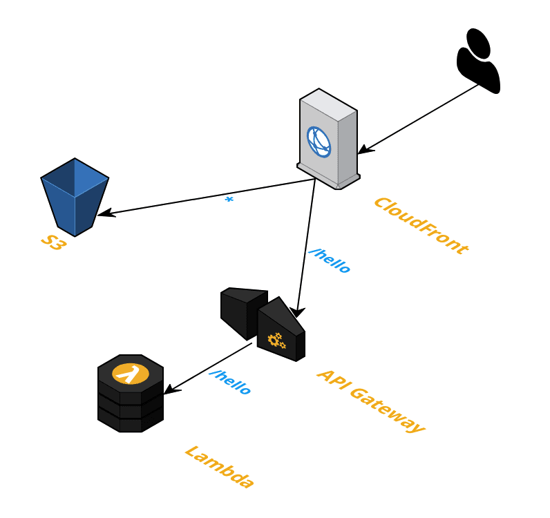
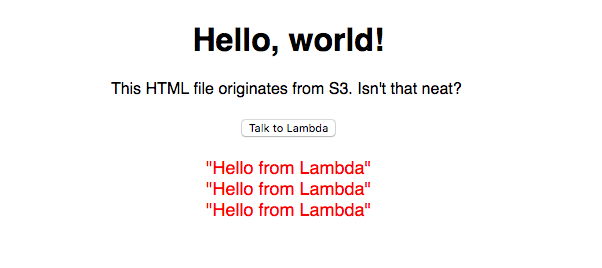

# The Minimal AWS Serverless Website (IMHO)

This is a CloudFormation template for a simple interactive website:
- A CloudFront distribution with two origins
- An S3 origin for static content
- An API Gateway origin for dynamic content
- The API Gateway proxies requests to a Lambda function

<p align="center"></p>

The website is a single page that makes an AJAX call to `/hello` when the "Talk to Lambda" button is pressed. The `/hello` call is routed by CloudFront to the API Gateway's `prod` stage. API Gateway routes the request to Lambda, which simply responds "Hello from Lambda". Once deployed, it looks like this:

<p align="center"></p>

## Creating the Stack
The included [create-stack.sh](create-stack.sh) shell script will prompt you for a stack name and do all the dirty work. Take a look at that script to understand everything going on, it's pretty straightforward.

Here's an example run:
```
$ ./create-stack.sh
Name for your CloudFormation stack: minimal-website-test
Submitting request to create stack minimal-website-test
arn:aws:cloudformation:us-east-1:0000000000000:stack/minimal-website-test/777210a0-43f6-11e8-81a2-50fae98974fd
Creation request submitted, waiting until it is done (this will take several minutes)...
Stack creation complete! Uploading static files to S3.
upload: static/error.html to s3://minimal-website-test-s3bucket-3jo44yqzgb26/error.html
upload: static/index.html to s3://minimal-website-test-s3bucket-3jo44yqzgb26/index.html

All done, you can access your new website here: https://d3o0qtp7w5nq7y.cloudfront.net

To cleanup the stack, execute these two commands:
  aws s3 rm --recursive s3://minimal-website-test-s3bucket-3jo44yqzgb26/
  aws cloudformation delete-stack --stack-name minimal-website-test
```

If you run into an error, you should get some helpful output. Here is an example from when I was testing the template:
```
$ ./create-stack.sh
Name for your CloudFormation stack: minimal-website-test
Submitting request to create stack minimal-website-test
arn:aws:cloudformation:us-east-1:0000000000000:stack/minimal-website-test/3e6bf810-43f2-11e8-8374-500c219a3c36
Creation request submitted, waiting until it is done (this will take several minutes)...

Waiter StackCreateComplete failed: Waiter encountered a terminal failure state

----------------------------------------------------------------------------------------------------------------------------------------------------------------------------------------------------------------
|                                                                                              DescribeStackEvents                                                                                             |
+--------------------------+-----------------------+-----------------------+-----------------------------------------------------------------------------------------------------------------------------------+
|           Date           |         Name          |        Status         |                                                            StatusText                                                             |
+--------------------------+-----------------------+-----------------------+-----------------------------------------------------------------------------------------------------------------------------------+
|  2018-04-19T16:54:17.308Z|  minimal-website-test |  ROLLBACK_COMPLETE    |  None                                                                                                                             |
|  2018-04-19T16:54:16.619Z|  APIGatewayRestApi    |  DELETE_COMPLETE      |  None                                                                                                                             |
|  2018-04-19T16:54:15.695Z|  APIGatewayRestApi    |  DELETE_IN_PROGRESS   |  None                                                                                                                             |
|  2018-04-19T16:54:15.105Z|  S3Bucket             |  DELETE_COMPLETE      |  None                                                                                                                             |
|  2018-04-19T16:54:14.970Z|  LambdaExecutionRole  |  DELETE_COMPLETE      |  None                                                                                                                             |
|  2018-04-19T16:54:14.543Z|  S3Bucket             |  DELETE_IN_PROGRESS   |  None                                                                                                                             |
|  2018-04-19T16:54:14.484Z|  APIGatewayResource   |  DELETE_COMPLETE      |  None                                                                                                                             |
|  2018-04-19T16:54:14.395Z|  LambdaExecutionRole  |  DELETE_IN_PROGRESS   |  None                                                                                                                             |
|  2018-04-19T16:54:03.341Z|  minimal-website-test |  ROLLBACK_IN_PROGRESS |  The following resource(s) failed to create: [LambdaExecutionRole, APIGatewayResource, S3Bucket]. . Rollback requested by user.   |
|  2018-04-19T16:54:02.431Z|  S3Bucket             |  CREATE_FAILED        |  Resource creation cancelled                                                                                                      |
|  2018-04-19T16:54:02.431Z|  LambdaExecutionRole  |  CREATE_FAILED        |  Resource creation cancelled                                                                                                      |
|  2018-04-19T16:54:01.872Z|  APIGatewayResource   |  CREATE_FAILED        |  Resource's path part only allow a-zA-Z0-9._- and curly braces at the beginning and the end.                                      |
|  2018-04-19T16:54:01.396Z|  APIGatewayResource   |  CREATE_IN_PROGRESS   |  None                                                                                                                             |
|  2018-04-19T16:53:59.363Z|  APIGatewayRestApi    |  CREATE_COMPLETE      |  None                                                                                                                             |
|  2018-04-19T16:53:59.202Z|  S3Bucket             |  CREATE_IN_PROGRESS   |  Resource creation Initiated                                                                                                      |
|  2018-04-19T16:53:59.069Z|  APIGatewayRestApi    |  CREATE_IN_PROGRESS   |  Resource creation Initiated                                                                                                      |
|  2018-04-19T16:53:58.983Z|  LambdaExecutionRole  |  CREATE_IN_PROGRESS   |  Resource creation Initiated                                                                                                      |
|  2018-04-19T16:53:58.620Z|  LambdaExecutionRole  |  CREATE_IN_PROGRESS   |  None                                                                                                                             |
|  2018-04-19T16:53:58.547Z|  APIGatewayRestApi    |  CREATE_IN_PROGRESS   |  None                                                                                                                             |
|  2018-04-19T16:53:58.521Z|  S3Bucket             |  CREATE_IN_PROGRESS   |  None                                                                                                                             |
|  2018-04-19T16:53:54.330Z|  minimal-website-test |  CREATE_IN_PROGRESS   |  User Initiated                                                                                                                   |
+--------------------------+-----------------------+-----------------------+-----------------------------------------------------------------------------------------------------------------------------------+

Creation of the stack failed. See the list of events above to understand what went wrong.

You might want to run the following to clean up:
  aws cloudformation delete-stack --stack-name minimal-website-test
```

## Some Important Bits
### Hiding `prod` in the API URL
API Gateway requires a "stage" component to be exposed in the URL, so our Lambda is really located at `/prod/hello`. I have hidden that in the CloudFront distribution by defining an `OriginPath`:
```
{
    "Id": "api-gateway",
    "CustomOriginConfig": {"OriginProtocolPolicy": "https-only"},
    "DomainName": {"Fn::Join": ["", [{"Ref": "APIGatewayRestApi"}, ".execute-api.", {"Ref": "AWS::Region"}, ".amazonaws.com"]]},
    "OriginPath": "/prod"
}
```

### Lambdas Require POSTs
Yep, you can't GET a Lambda. I worked around this in the Integration section of the API Gateway's Method declaration:
```
"Integration": {
    "Type": "AWS",
    "IntegrationHttpMethod": "POST",
    "Uri": {
        "Fn::Join": ["", [
            "arn:aws:apigateway:", {"Ref": "AWS::Region"}, ":lambda:path/2015-03-31/functions/", {"Fn::GetAtt": ["LambdaFunction", "Arn"]}, "/invocations"
        ]]
    },
    "IntegrationResponses": [{"StatusCode": "200"}]
}
```

## The "Unnecessary" Parts
Nearly everything in the template is required to be there. Here are the parts which could be removed if necessary:
 - `PriceClass` - The CloudFront distribution is set to "Use Only US, Canada and Europe". It defaults to a global distribution, I set it to the lowest in the hopes it would speed up things a little.
 - `Description` - Technically you don't have to add a description to your CloudFormation template.

## Why I Wrote This
This seems like the starting point for many types of serverless projects on AWS. I was building a simple website and combed through several blog posts and StackOverflow questions to figure out what I needed. It took me a long time to separate what was really required, so I decided to take out anything unnecessary as a good example.